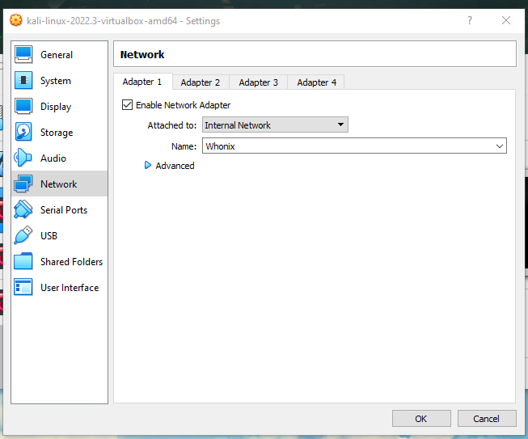
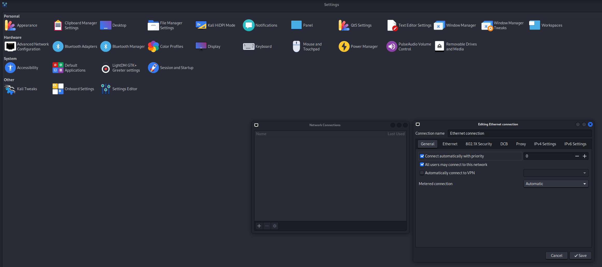
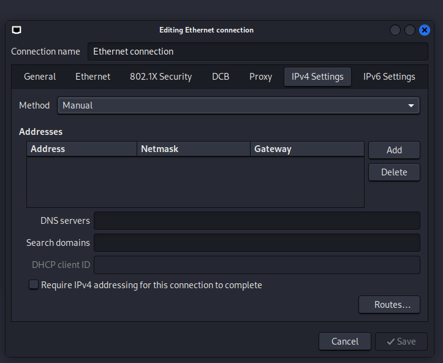
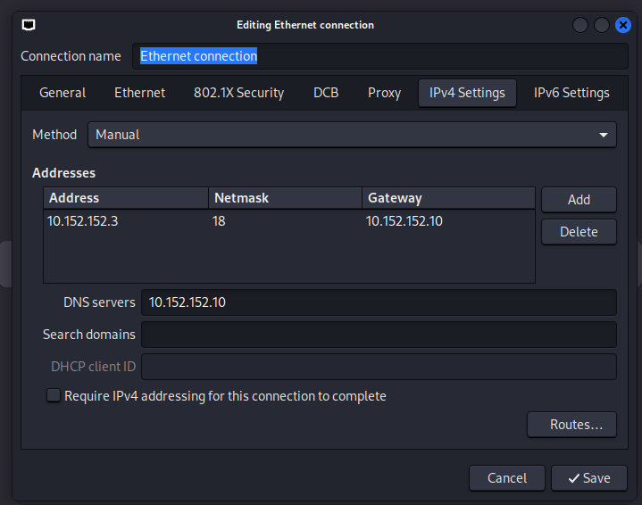

# Whonix Gateway com Kali

### Primeiro passo e fazer downloads do virtual box e suas imagens:

- Virtual Box: [https://www.virtualbox.org/wiki/Downloads](https://www.virtualbox.org/wiki/Downloads)

- Kali Linux: [https://www.kali.org/get-kali/#kali-virtual-machines](https://www.kali.org/get-kali/#kali-virtual-machines)

- Whonix: [https://www.whonix.org/wiki/VirtualBox](https://www.whonix.org/wiki/VirtualBox)

---

### Configuração do ambiente.

Na parte de configuração de rede do Kali (ou outro OS) certifique se de que o kali esta conectando na rede interna do Whonix Gateway.

Segue print de exemplo:

Após primeiro boot no Whonix Gataway, atualização de sistema e etc, fazer boot no Kali, para configurarmos a conexão com o Gataway.

Em IPV4 Settings na opção Method, marcar o methodo manual!

Adicionar um IP manual na configuração, o endereço de IP exato pode ser obtido na VM do whonix workstation.

A rede interna do Whonix 10.152.152.xx

Exemplo de configuração:

##### address 10.152.152.11
##### importante! netmask 255.255.192.0
##### network 10.152.152.0
##### broadcast 10.152.191.255
##### importante! gateway 10.152.152.10
##### dns-nameservers 10.152.152.0

- O Whonix Gateway pode ser usado com qualquer sistema operacional rodando na VM, o Kali linux so foi usado de exemplo.

### E importante deixar a VM do Whonix Gateway executando para deixar o IP do kali anonimo!