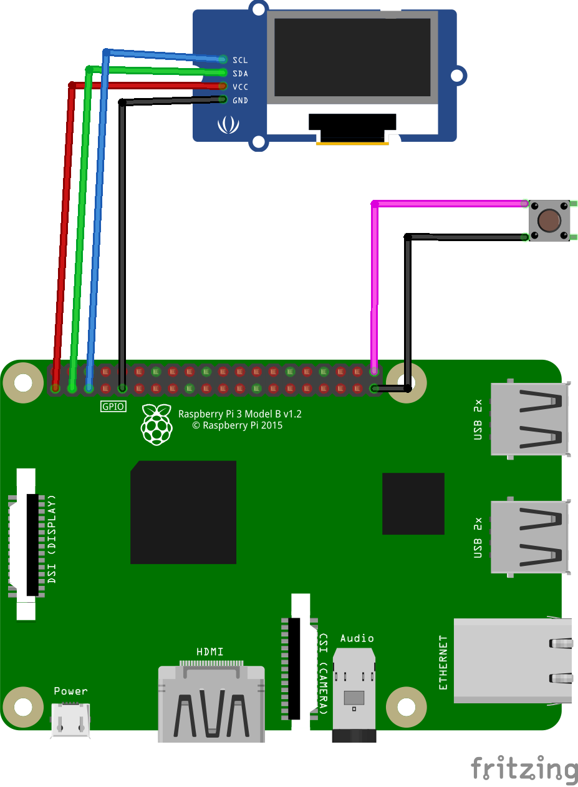

# Display de status do Raspberry Pi

### Instalação do display e botão no Raspberry pi 3+.

Obs: O display usado e um display i2c gererico.

---

### Comandos para instalação do software do display.

Sistema usado: Raspberry Pi OS Bulleye (A dist Linux oficial do Raspberry)

1. Atualizar o sistema com “sudo apt-get update” e “sudo apt-get full-upgrade”
2. Instalar o git com “sudo apt-get install git”
3. Instalar o pip com o comando “sudo apt-get install python3-pip”
4. Instalar o setuptools com o comando “sudo pip3 install --upgrade setuptools”
5. Ir para o diretorio de usuario com “cd ~”
6. Instalar os pacotes adafruit “sudo pip3 install --upgrade adafruit-python-shell”
7. Baixar o script de instalação do display com o comando “wget https://raw.githubusercontent.com/adafruit/Raspberry-Pi-Installer-Scripts/master/raspi-blinka.py”
8. Executar o script com “sudo python3 raspi-blinka.py”
9. Fazer reboot do Raspberry Pi
10. Instalar mais pacotes do display com “pip3 install adafruit-circuitpython-ssd1306”
11. Mais pacotes… “sudo apt-get install python3-pil”
12. Baixar o programa em python do github com: “git clone https://github.com/mklements/OLED_Stats.git”, ou para a versão com o botão para ligar ou desligar o display baixar com esse comando “git clone https://github.com/IgorNMS/ShowPiStats.git”
13. Executar a aplicação com “python3 stats.py”

Opcional: Setar o script para iniciar sozinho apos o reinicio do Raspberry Pi