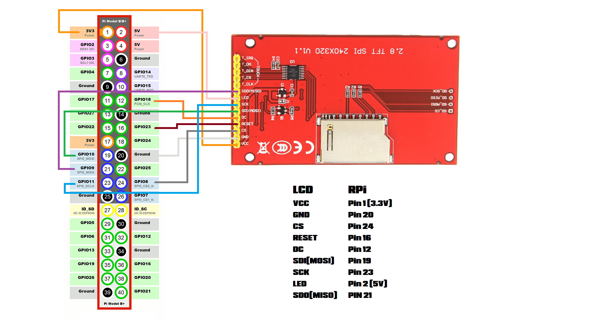

# Instalação do Display ILI9341 de 2.8"

### Esse tutorial foi retirado do seguinte video do youtube:

[2.8" LCD Display on a Raspiberry Pi ft ILI9341](https://www.youtube.com/watch?v=I0TMbUpa4ig)

## Diagrama:

### Segue o codigo fonte usado no video:

[Codigo fonte do criador do video](https://github.com/VirusHQ/youtube_video_tutorial_codes/tree/master/2.8_LCD_display_on_a_Raspberry_Pi_ft_ILI9341)

### Codigo fonte da Adafuit:

[Codigo fonte da Adafruit (precisa de ajustes para ser funcional)](https://github.com/adafruit/Adafruit_CircuitPython_RGB_Display)

### Comandos interessantes no python para se manter em mente:

Para criar um ambiente virtual em python basta inserir o comando: `python -m venv meu_ambiente_virtual`

Para ativar o ambiente no linux: `source meu_ambiente_virtual/bin/activate`

Para ativar o ambiente no windows: `meu_ambiente_virtual\Scripts\activate`

Para desativar o ambiente virtual: `deactivate`
